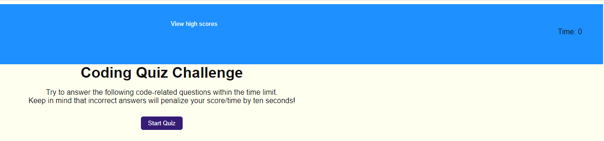
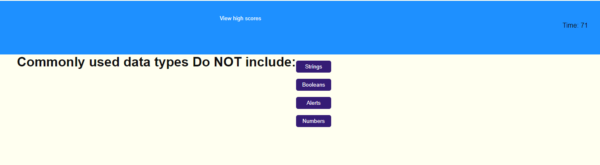
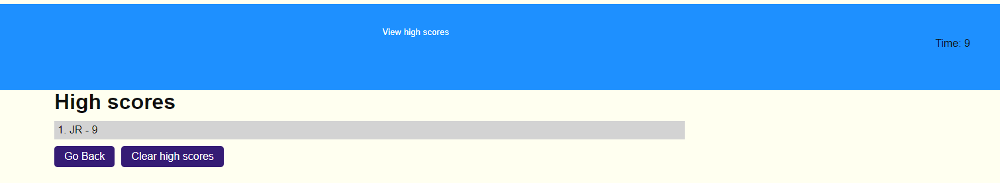

<h1>Coding Quiz<h1>

https://jeremyrice98.github.io/code-quiz/

A practice in using html, CSS, and javascript.  

<h1>Here is how to use the quiz:</h1>

1. Click Start Quiz to begin

2. Answer the questions by clicking on the correct answer.  At the bottom, it will tell you whether you are correct or wrong.

3. Upon completing the quiz, you will be asked to enter your initials to enter high scores.  You also will have the ability to clear the high schores 

4. You can click on Go Back to go back to the beginning of the quiz. 
